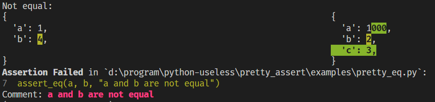

# pretty_assert

[English](./README.md) | 简体中文

打印漂亮的、**用户友好**的 assert 信息。



## 特色

- 不打印让用户迷惑的 trace
- 添加 Comment
- 自定义化丰富的颜色
- `assert_eq` 加强，diff

## 安装

```sh
pip install pretty-assert
```

## 使用

```python
from pretty_assert import (
    init,
    assert_,
    assert_eq,
    assert_ge,
    assert_gt,
    assert_in,
    assert_le,
    assert_lt,
    assert_ne,
    assert_not_in,
)
some_bool = True
some_number = 1
assert_(some_bool)  # you can assert without comment
assert_(some_bool, "some_bool is not True")
assert_eq(some_number, 1, "some_number is not 1")
...
```

更多用法与自定义设置请查看 [examples](./examples/)。

## Thanks

- [assert2](https://crates.io/crates/assert2)：灵感来源
- [pytest-icdiff](https://github.com/hjwp/pytest-icdiff)：代码借鉴
